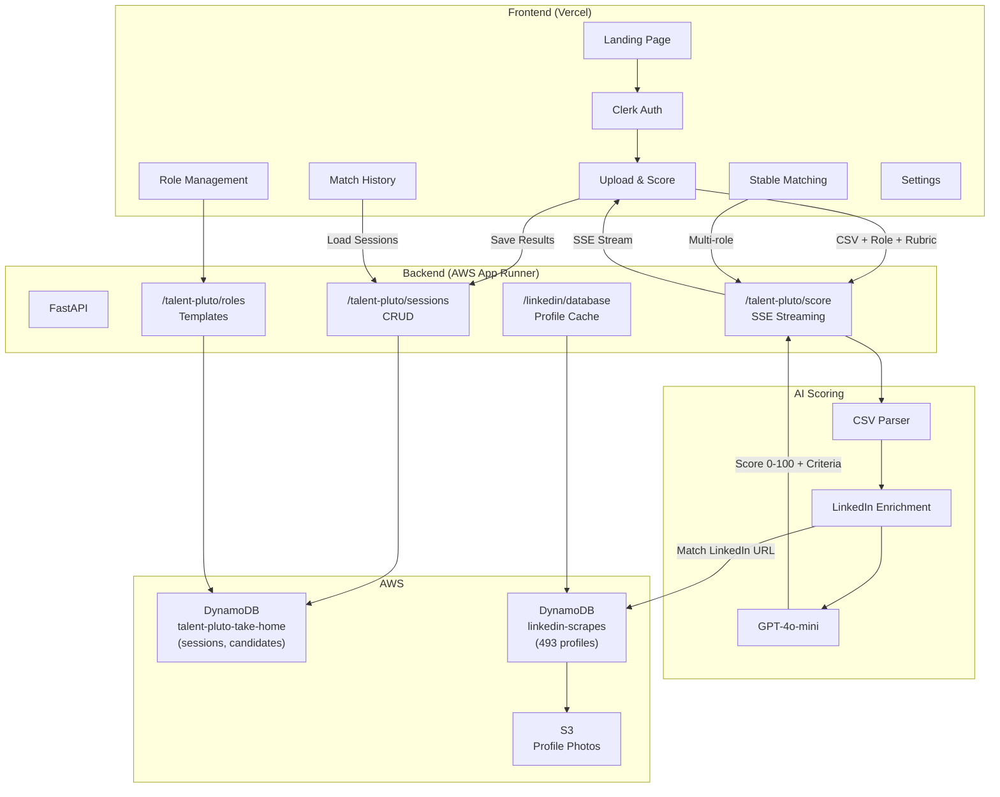
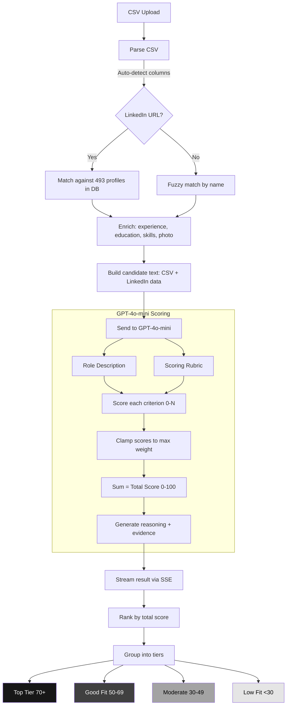
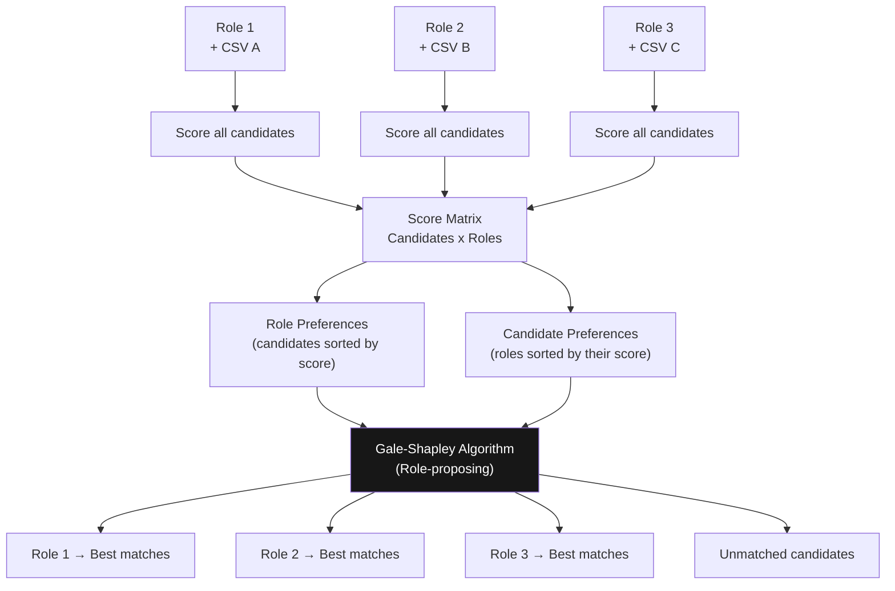
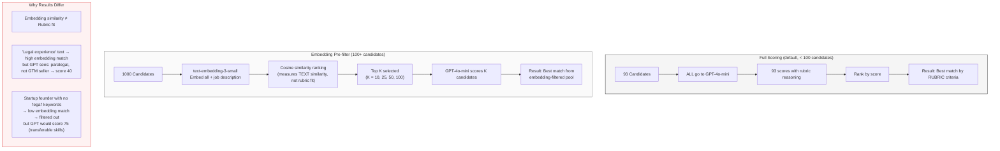
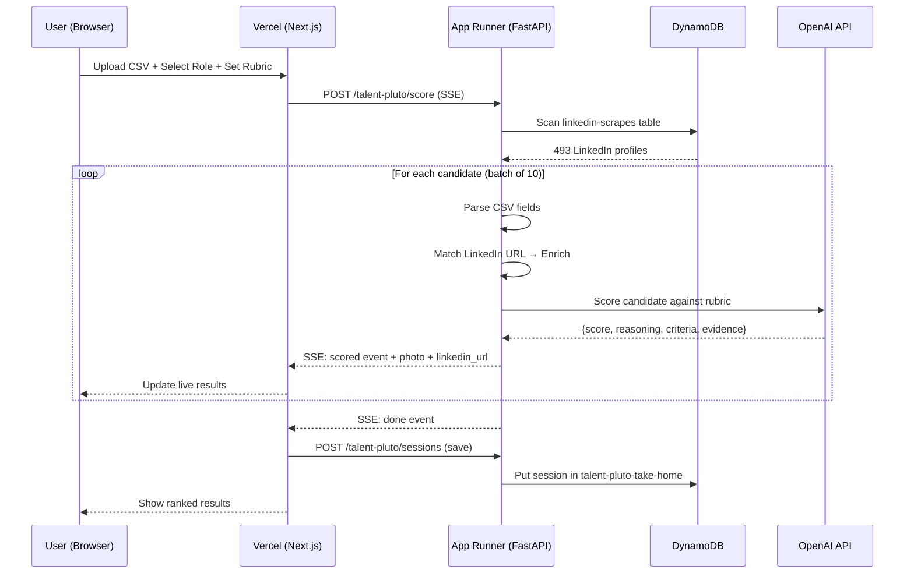

# Architecture

## System Architecture

## Matching Algorithm

## Scoring Rubric Flow

```mermaid
flowchart LR
    subgraph Presets["Judge Presets"]
        G1["The Generalist<br/>Balanced weights"]
        G2["The Hunter<br/>Outbound focus"]
        G3["The Closer<br/>Deal closing focus"]
        G4["The Pedigree<br/>Company + school"]
        G5["The Builder<br/>Startup DNA"]
        G6["Custom<br/>User-defined"]
    end

    Presets -->|Sets weights| Rubric

    subgraph Rubric["Scoring Rubric"]
        C1["Relevant Experience<br/>0-25 pts"]
        C2["Industry Fit<br/>0-20 pts"]
        C3["Sales Capability<br/>0-20 pts"]
        C4["Stakeholder Presence<br/>0-15 pts"]
        C5["Cultural Fit<br/>0-10 pts"]
        C6["Location<br/>0-10 pts"]
    end

    Rubric -->|Injected into prompt| GPT["GPT-4o-mini"]
    GPT -->|Per-criterion scores<br/>+ evidence| Result["Total: 0-100"]
```

## Stable Matching (Gale-Shapley)

## Matching Algorithm Comparison: Full vs Embedding Pre-filter

### When to use which:

| Scenario | Algorithm | Why |
|----------|-----------|-----|
| < 100 candidates | Full (no filter) | Score everyone, most accurate |
| 100-500 candidates | Top 50-100 | Good balance of speed + accuracy |
| 500+ candidates | Top 100 | Necessary for cost, but may miss edge cases |
| Need absolute accuracy | Full (All) | Pay more, get every candidate scored |

### Key insight:
Embedding pre-filter is a **speed optimization**, not an accuracy improvement. It can miss candidates that GPT would score highly but whose text doesn't "look similar" to the job description. For < 100 candidates, always use full scoring.

## Data Flow

